# BDU-Generative-Art Tutorial
BDU Generative Art Collaboration
This is for Week 3 of the BDU NFT Course.

# Results You can expect
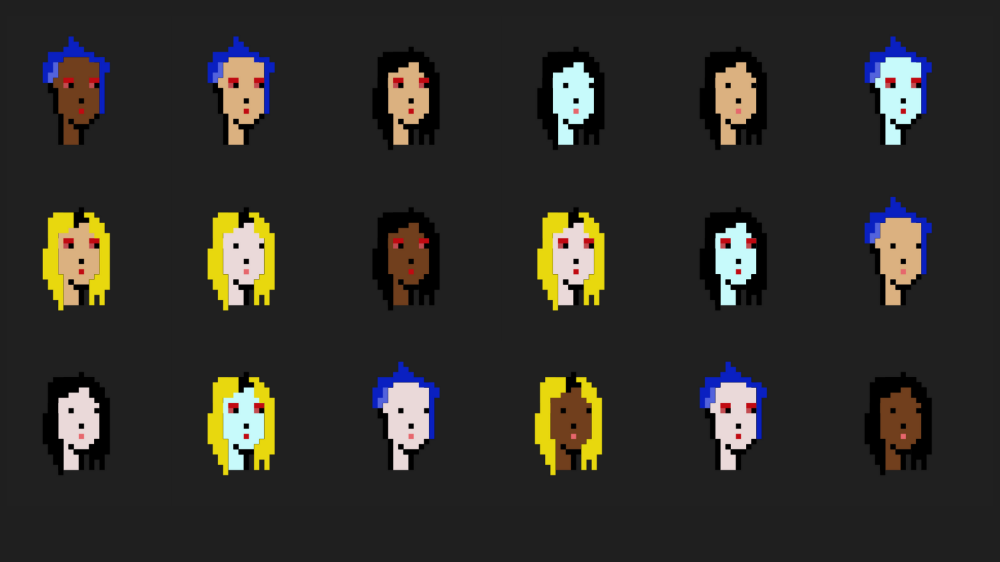
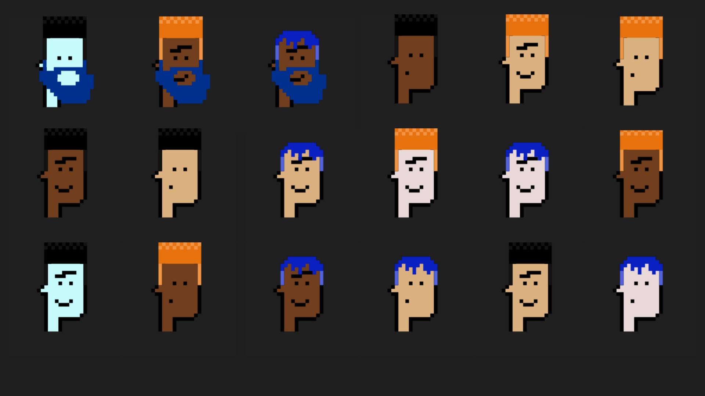

# What is a way to see this challenge?
You can consider that this challenge has two parts:
- Layers vision (Images)
- Developer vision (Art Engine)

So you can start with any of them: Art Engine or Images.
<br>
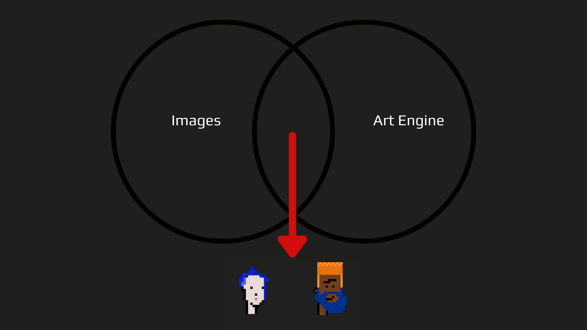

# Steps to run 

## Art Engine

Create generative art by using the canvas api and node js. Before you use the generation engine, make sure you have node.js and yarn installed.

## Installation

```sh
git clone 

yarn add all
```

## Usage

Create your different layers as folders in the 'layers' directory, and add all the layer assets in these directories. 

Once you have all your layers, go into `src/config.js` and update the `layersOrder` array to be your layer folders name in order of the back layer to the front layer.

*Example:* If you were creating a portrait design, you might have a background, then a head, a mouth, eyes, eyewear, and then headwear, so your `layersOrder` would look something like this:

```js
const layersOrder = [
    { name: 'Background'},
    { name: 'Ball'},
    { name: 'Eye color' },
    { name: 'Iris' },
    { name: 'Shine' },
    { name: 'Bottom lid' },
    { name: 'Top lid' },
];
```

The `name` of each layer object represents the name of the folder (in `/layers/`) that the images reside in. 

Then optionally, update your `format` size, ie the outputted image size, and the `editionSize`, which is the amount of variation outputted.

Make sure you have installed Canvas. You can install this node module by running the following command:

```sh
yarn add canvas@next
```
If for some reason the installation stays in a loop. Try stopping it and execute the command above again.

When you are all ready, run the following command and your outputted art will be in the `build` directory:

```sh
npm run build
```
## Images

In order to have your own generative arts you need to have some layers to use on your Art Engine.

### How can I create some layers?

You can use a free online editor and save your work locally by using: https://www.piskelapp.com/

- Click on Create Sprite and start creating some layers

So now you are able to start creating some layers. Right?

#### Creating layers step by step

If everything went well you will see PiskelApp ready to start creating:

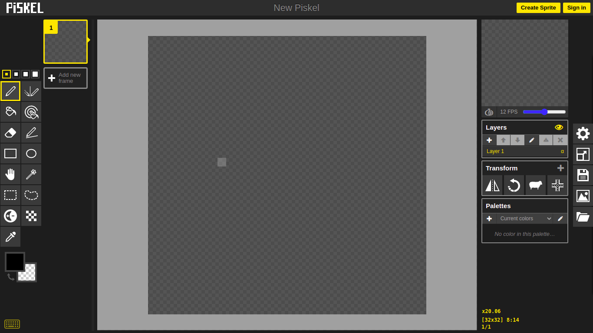

In this case we are going to create two layers:
- Head Layer
- Skin Layer

##### Create your first layer

- Creating Head Layer

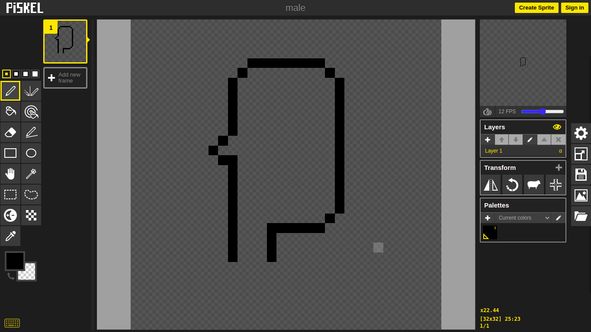

- Saving Head Layer

Click on Export button

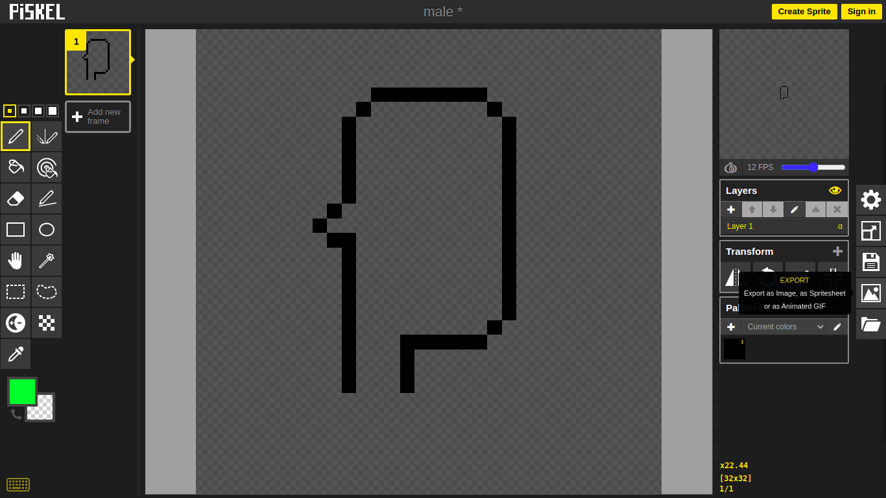

- Personalize the Scale -> 10x is something that works
- Click on Download

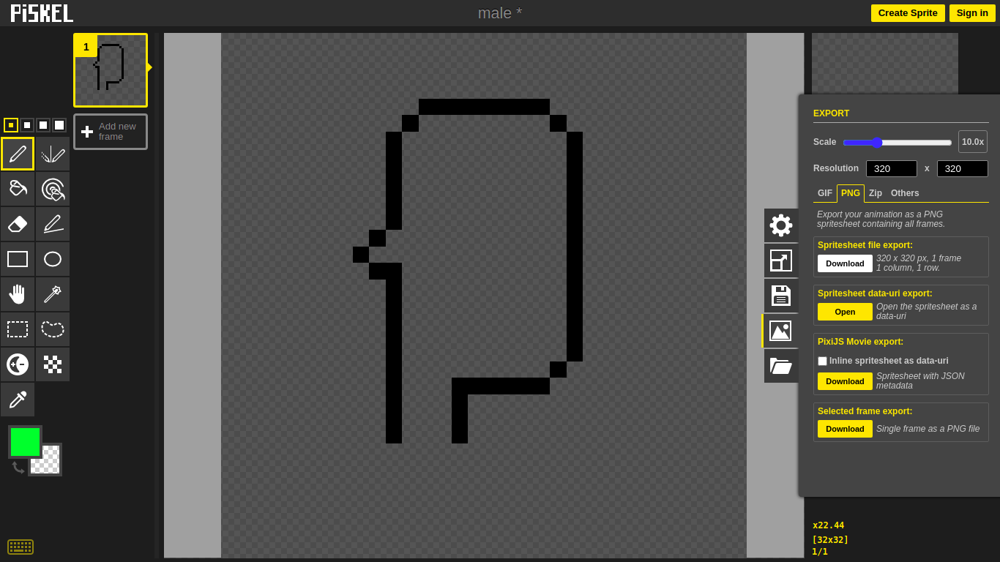

The result

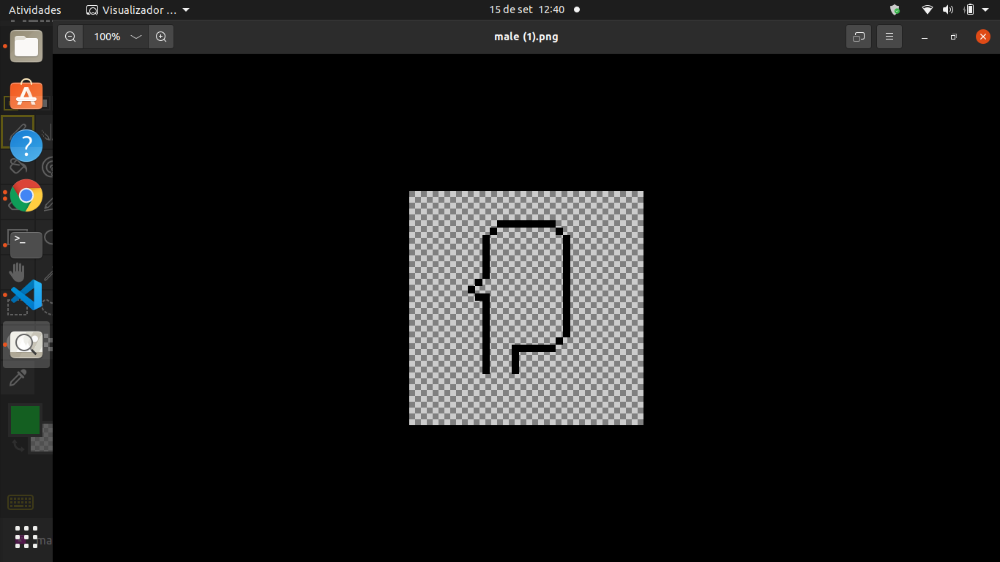

##### Create your second layer

Skin Layer

By clicking on Create a layer

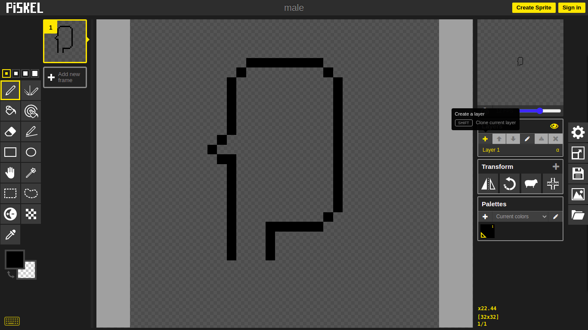

- Creating Skin Layer

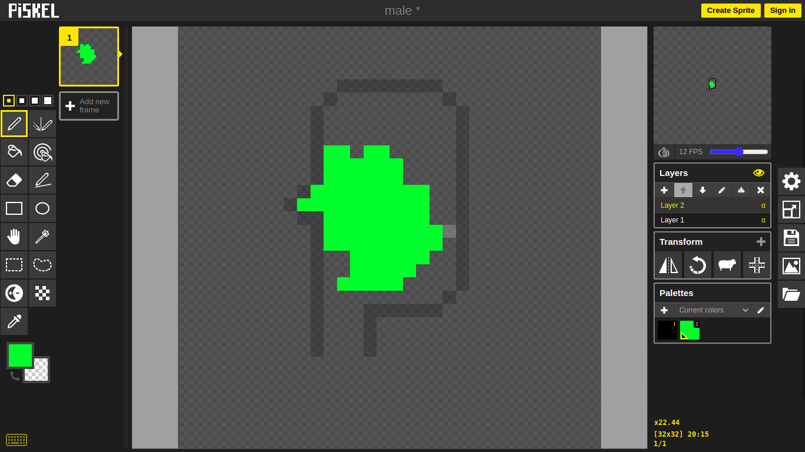

- Deleting Head Layer

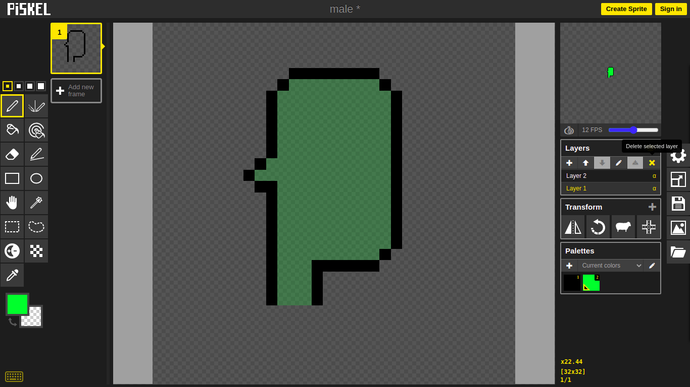

- Save your Skin Layer

The result

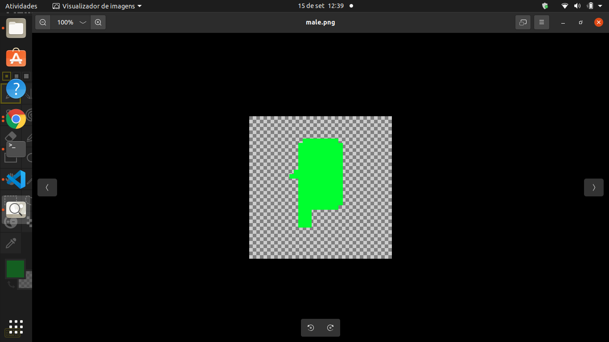

Now you probably have two things: the Art Engine ready to use and your layers. Time to try!

## LAST STEP: Collaborating Folder

There is a public folder where you can:

- Get some "skeleton" to use in your creations (Base folder)
- Save your layers so that they will be considered for the collection (Ready Creations folder). Consider give name to your layers that represents your original inspiration :)

Collaborating Folder: https://drive.google.com/drive/u/0/folders/1oH579VB0AQ5omF8-xYTeGbimGR23-qVp

#### Base folder

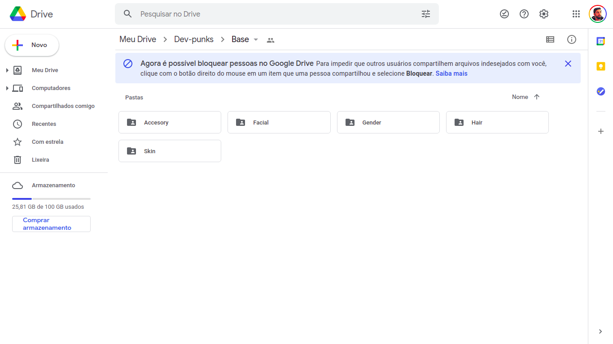

#### Ready Creations folder

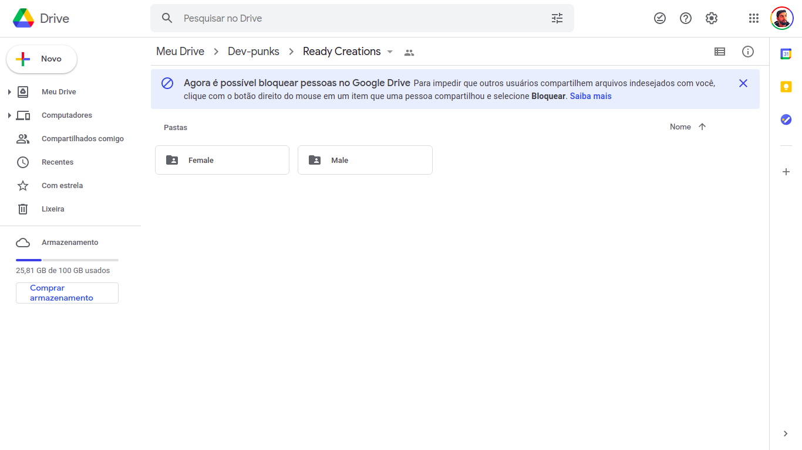

## Tutorials
Here is a list of useful Tutorials. List Generative Art Tutorials

### Written Tutorials
An introduction to Generative Art: what it is, and how you make it
* https://aiartists.org/generative-art-design - recommends an Edx course
* Generative Art NFTs With Python and Solidity | by Parker Ferguson | Sep, 2021
* Monster Guide to Creating Generative Art NFTs
* https://medium.com/web-design-web-developer-magazine/how-to-prepare-artwork-for-a-generative-nft-programmer-970adf59c042 (NiftyNinja)
* https://www.google.com/url?sa=t&rct=j&q=&esrc=s&source=web&cd=&ved=2ahUKEwil_p_Wif_yAhUHmuAKHdrgA2wQFnoECBMQAQ&url=https%3A%2F%2Fwww.generativehut.com%2Ftutorials&usg=AOvVaw3P0_MscFj6uzWOcQ9t5222
* https://blog.kreechures.com/generative-nfts/
* https://www.linkedin.com/pulse/monster-guide-creating-generative-art-nfts-jillian-hinds-williams
* https://blog.kreechures.com/generative-nfts/

### Youtube Tutorials:

* Code generative art for NFT in node.js part 1MS
* How To Create An ENTIRE NFT Collection (10,000+) In Under 1 Hour Without Coding Knowledge
* How To Create 10,000 Generative Art NFT Like Cryptopunks In 15 Mins with No Coding Experience
* How to make a NFT Project like Crypto Punks or Bored Apes!
* How to Set Up a Generative NFT Art Collection/Project
* How to Create an NFT Collection (10,000+) No Coding Knowledge Needed
* Code a 10000 NFT Minting Dapp part 1
* The Defiant Guide to Art Blocks - Generative art - Good non-technical view of NFTs
🌿 How to mint NFTs directly from the contract | Etherscan tutorial
* Code generative art for NFT in node.js part 2
Jan - Non fungible tokens, EIP 1559 


### Github Repositories:
* Antoine - https://github.com/NotLuksus/nft-art-generator
* Kedar-
https://github.com/HashLips/hashlips_art_engine
* https://github.com/HashLips/nft_collection_minter
* https://github.com/HashLips/generative-art-node
* https://github.com/terkelg/awesome-creative-coding

### Tools
* Generative art tutorial without coding with a free online tool


## Tasks

* Antoine - Research Generative art projects to see how they did it

* Kedar - Execute Generative art program with different images

* Alex - Try your images in the generative art program

* navlar - get Hard Drive to make us some base images

* Everyone - Try tutorials and report back

* Streamerd - Give us some art components we can use

* violeta - research generative music NFT's

* MS - look into AI generative art

## How to collaborate

Tell us your github id in the discord, or make pull requests. Add your work in your own folder please. 
